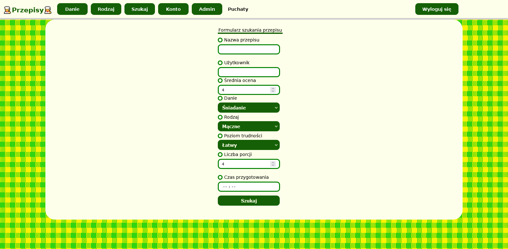
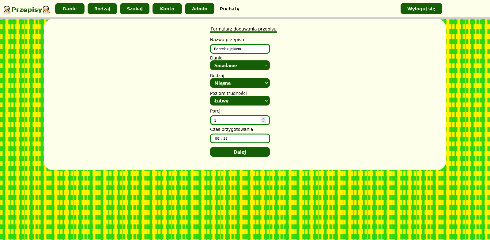
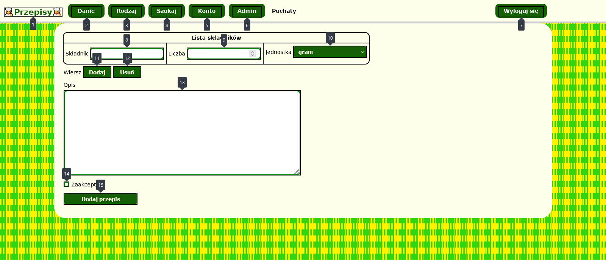

# Przepisy kulinarne
## PL
**Technologie**
JavaScript, PHP 5.6, MySQL (MariaDB)  
WAVE, narzędzie Dostępność Firefoksa 

Strona internetowa o przepisach kulinarnych. Zawiera m.in. CRUD przepisów czy tworzenie konta. 
Na stronie głównej wyświetlane są przepisy ostatnio dodane oraz te z najwyższą oceną.
Strona z przepisem ma takie informacje jak rodzaj posiłku, liczba porcji, czas przygotowania czy listę składników. 
Witryna posiada także wyszukiwarkę, która pozwala wyszukiwać po każdej właściwości przepisu. 
Dodawanie przepisu składa się z dwóch etapów:
1. Podaje się informacje podstawowe: nazwę, danie, rodzaj, poziom trudności, liczbę porcji oraz czas przygotowania.
2. Podaje się właściwy przepis, czyli listę składników (stworzoną na rozbudowującej się tabeli) oraz opis.

Istnieją dwa typy kont: użytkownik zwykły oraz administrator. 
* Niezarejestrowany użytkownik może przeglądać i wyszukiwać przepisy oraz założyć konto. 
* Zwykły uzyskuje możliwość oceniania przepisów oraz dodawania ich do ulubionych, dzięki czemu będzie miał je szybko dostępne z zakładki konta. 
  Ponadto może dodać przepis oraz sprawdzić statystyki np. ile dodał i ocenił przepisów, a także średnią ocenę jego przepisów od innych użytkowników. 
* Administrator oprócz tego akceptuje przepisy z poczekalni, dodaje kategorie czy edytuje lub usuwa przepisy. 

Ponadto witryna została dostosowana do wytycznych WCAG (dostępność cyfrowa strony).  
Audyt przeprowadzono wtyczką WAVE oraz zakładką „Dostępność” z narzędzi deweloperskich Firefoksa.

**Uruchomienie**
1. Pobieramy, instalujemy i uruchamiamy pakiet XAMPP
2. W XAMPP uruchamiamy serwery Apache oraz MySQL
3. Importujemy bazę z pliku database.sql 
   3.1. Klikamy przycisk Admin w wierszu MySQL. Otworzy się phpMyAdmin 
   3.2. W nim z górnej belki naciskamy import 
   3.3. W oknie importu wskazujemy plik i naciskamy import
4. Umieszczamy pliki projektu do folderu htdocs (znajduje się w lokalizacji instalacji XAMPP-a)
5. Witryna dostępna jest pod https://localhost/<nazwa-folderu>/sites/index.php  
   (po pobraniu z GitHuba domyślna nazwa-folderu to Przepisy-kulinarne-main)  

Maj-czerwiec 2021  
Czerwiec 2023 (WCAG)

## EN
**Technologies**
JavaScript, PHP 5.6, MySQL (MariaDB) 
WAVE, Firefox availability tool 

Website about culinary recipes. Contains among others recipes CRUD or account creating. 
Home page show last added and highest rated recipes.
Recipe page contains info about meal category, number of portions, prepare time or ingredients list. 
Website also has searcher, which allows search by all recipes properties. 
Recipe adding is composed of two stages:
1. User enter basic info: name, meal, category, difficulty level, number of portions and prepare time.
2. User enter properly recipe that is ingredients list (created on expanding table) and description.

Exists two account types: regular user and admin. 
* Non registered user can browse and search recipes and create account. 
* Regular user can mark recipes and add hims to favourites, whereby user will have quick access from account tab. 
  Moreover user can add recipe and check statistics ex. how many recipes add and marks as well as average rates of him recipes from other users. 
* Admin furthermore accept recipes from waiting room, add categories or editing/remove recipes. 

Moreover, website has adopted to WCAG guidelines (page digital availability).  
Audit was carried out WAVE plugin and "Availability" tab from Firefox developer tools.

**Launching**
1. Download, install and run XAMPP package
2. In XAMPP run Apache and MySQL servers
3. Import database from file database.sql 
   3.1. Click Admin button in MySQL row. Should open phpMyAdmin 
   3.2. In phpMyAdmin on the top bar click import 
   3.3. In import window choose file and click import
4. Place project files to htdocs folder (is located in XAMPP install localization)
5. Website is available in link https://localhost/<folder-name>/sites/index.php  
   (after downloading from GitHub default folder-name is Przepisy-kulinarne-main) 

May-June 2021  
June 2023 (WCAG)

Strona główna  
Home page

Wyszukiwarka  
Searcher

Dodawanie przepisu  
Recipe add

Dodawanie przepisu — lista składników  
Recipe add — ingredients list

Poczekalnia — akceptacja przepisu  
Waiting room — recipe accept

Strona przepisu  
Recipe page

Strona statystyk  
Statistics page

**WCAG**  
Strona przepisu audytowana WAVE  
Recipe page audited by WAVE

Strona główna audytowana WAVE  
Home page audited by WAVE

Strona przepisu z symulowaną deuteranopią (nierozpoznawaniem zieleni)  
Recipe page with simulated deuteranopy (non-recognition of green)

Dodawanie przepisu — lista składników z nałożoną kolejnością focusu przycisków przy naciskaniu tabulatora 
Recipe add — list of ingredients with overlay buttons focus order when pressing tab key
